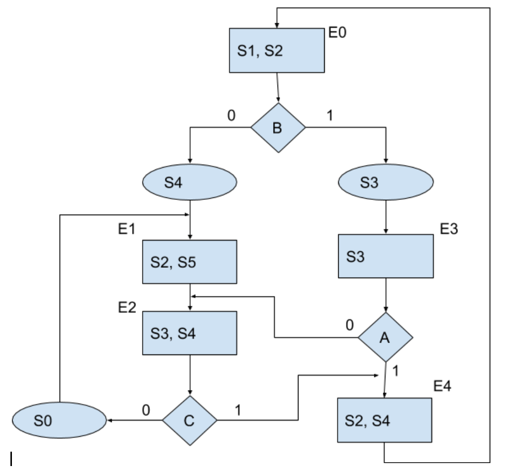
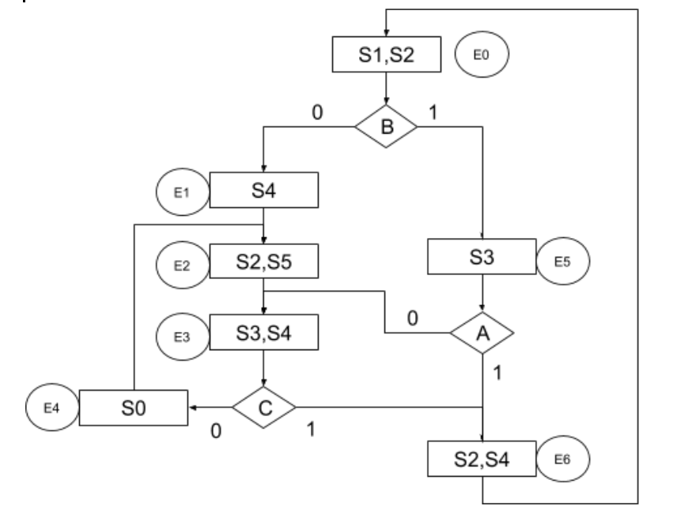

# Práctica 7: Modos de direccionamiento
```
17/10/2019
```  
Implementación de una carta ASM en memoria utilizando diferentes métodos de direccionamiento  
* Direccionamiento por trayectoria
* Direccionamiento entrada-estado

## Integrantes
Lopéz Mártinez Andrés  
Mártinez Mártinez Andrés  
Morales Téllez Carlos Gamaliel  
Pérez Quiroz Miguel Ángel  

## Por trayectoria
### Carta ASM


## Entrada estado
### Carta ASM


## Video
[Mira en YouTube](https://youtu.be/_E6zRUgcOAg)
